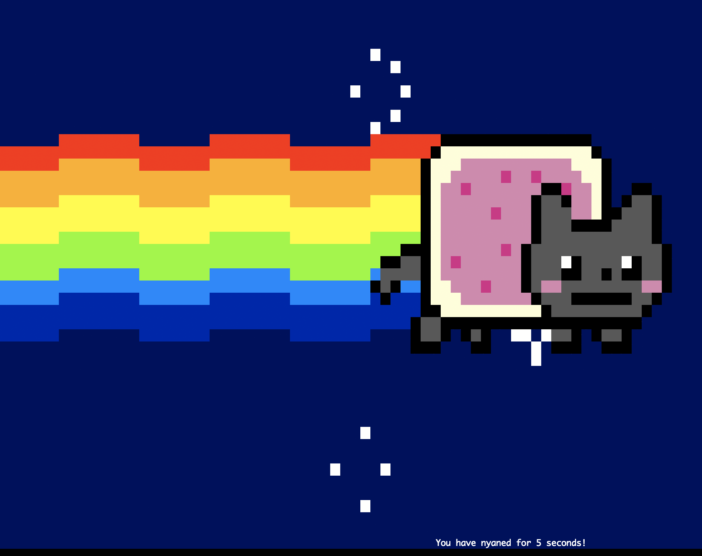

# GBC 32 Programmer Base


## Day 1


### Abstraction

20년도 이전에만 해도 이 과목은 `Linux Baics`를 배우던 과목이었습니다. 30기 부터 생긴 이 과목은 `Linux Basics` 와 더불어 우리가 수업에서 대강 너머간 부분들, 프로그래머로써 꼭 필요한 도구들을 잘 다루는 방법을 배우도록 하겠습니다.

교제 1은 `Ubuntu` 텍스트 북입니다. 밑의 `교제2` 에 나오는 것 처럼 다 이해를 못 하시더라도 이런게 있구나 하시고 넘어가셔도 됩니다. 그래도 한번씩 실행시켜보시고 나중에 이런게 있었지 라고 기억하실 정도로만 일단 아셔도 됩니다.

[주교제 2](https://ccss17.netlify.app/programmerbase/)
[참조 1](https://missing.csail.mit.edu/)
[참조 2](https://linuxcommand.org/tlcl.php)

#### 한 주 동안 배우는 내용
- Linux commands
- Docker
- VScode extensions
- vim
- tmux, zsh, markdown, git
- 각종 cli tools

### Docker 설치

아래의 링크타셔서 그대로 따라해주세요. docker container에서 위의 명령어들을 실습하시면 됩니다.
https://ccss17.netlify.app/programmerbase/01-day1/readme/ 


### 과제

1. 교재 읽고 따라해보기 ch.1 ~ ch.2
2. Docker 로 container 다운로드 및 `nyancat` 실행해보기
    ```sh
    $ nyancat
    ```

    
3. https://ccss17.netlify.app/programmerbase/01-day1/readme/ 읽기


## Day 2

### VSCode 설치 && git 설치 && Markdown 공부
https://ccss17.netlify.app/programmerbase/02-day2/readme/

### 과제
1. 교재 읽고 따라해보기 ch.3 ~ ch. 4
2. https://github.com/qpalzmm22/GBC32_ProgrammerBase.git fork하고 Day1 에 본인 이름으로 directory 만들어서 `pull request` 하기 


## Day 3

### 과제
1. 교재 읽고 따라해보기 ch.5 ~ ch. 6

## Day 4

### 과제
1. 교재 읽고 따라해보기  ch.7 ~ ch. 7.2 , ch. 8(부분적), ch. 9, ch. 10

## Day 5

### 과제
