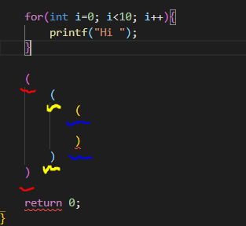

# Bracket Pair Colorizer

>**Bracket Pair Colorizer**는 VS Code에서 제공하는 style-extension입니다.

- 7+ million installs
- 4.5 Average rating
- Free extension
- Increase Readability and Visuality of Source code

 

>**History**

- First release: 3 Dec 2016
- Last release: 13 Dec 2021 (Version 1.0.62)

 

>**Example**

 

**VS native functionality**

- Now the VS Code's native functionality is available.

- **However**, Bracket Pair Colorizer provides customizing modes with different color sequences.
- Still, worty to **install!!**

