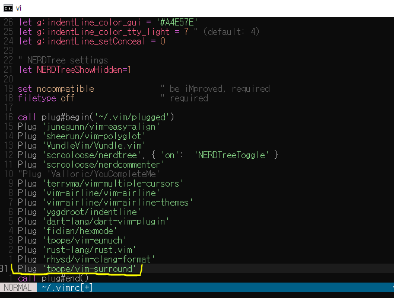
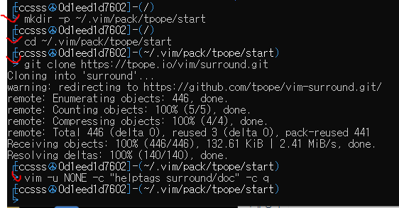
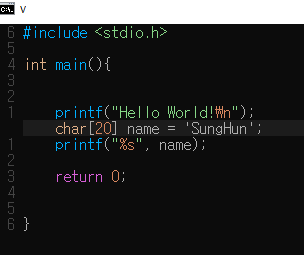

# SURROUND.VIM

>**Surround.vim** is all about "surroundings" : 

parentheses, brackets, quotes, XML tags, and more. The plugin provides mappings to easily delete, change and add such surroundings in pairs.

- cs + A B
    - ex) [ cs'" ] 'Hello' -> "Hello" 
  
- ds + A
    - ex) [ ds" ] "Hello" -> Hello

- ys+ A B
    - ex) [ ysiw] ] Hello -> \[Hello] (iw = test object)

 

>**History**

 

>**Installation**

1. home directory의 최상위에서 $ vi ~/.vimrc

 

2. Plug 'tpope/vim-surround' 추가

 
3. home directory의 최상위에서 아래 **commandLines** 입력

 

>**Example**

# cli: cs'"

Before

After

